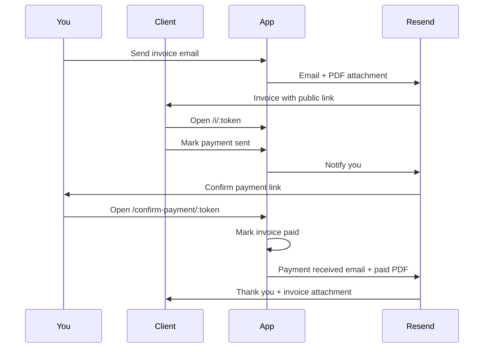

# MyNvoice

A clean invoicing app for freelancers and solo operators. Create professional invoices, track billable work on a calendar, manage clients, and handle the full payment lifecycle — from sending an invoice to confirming payment — without leaving your browser.

Built with React, Supabase, and Resend.

---

## Features

### Invoices

- Create drafts or send invoices directly to clients
- Hourly and fixed line items, optional tax, notes, and payment instructions
- Auto-incrementing invoice numbers
- Status tracking: **Draft**, **Unpaid**, **Overdue**, **Payment sent**, and **Paid**
- Live print preview and one-click PDF download
- Email invoices with a PDF attachment via Resend

### Clients

- Store company name, contact, address, and multiple email addresses
- Save default hourly rates and additional rate tiers
- Define recurring line items that roll into the calendar automatically

### Calendar

- Log billable work day by day
- See unbilled totals at a glance
- Import calendar entries into new invoices
- Recurring items appear on scheduled days (with per-client exclusions)

### Email templates

Customize HTML email templates with a live preview:

| Template | When it's used |
| --- | --- |
| **Unpaid** | New invoices and resends while payment is outstanding |
| **Reminder** | Friendly follow-up for unpaid invoices |
| **Late** | Overdue notices |
| **Payment received** | Sent to the client after you confirm payment |

Templates support variables like `{{clientName}}`, `{{invoiceNumber}}`, `{{total}}`, `{{invoiceLink}}`, and `{{paymentDate}}`.

### Public payment flow

Clients don't need an account. Invoice emails include links to a public invoice page where they can:

1. View the full invoice
2. Click **Payment has been sent** when they've paid
3. Wait for you to confirm receipt

You receive an email with a **Payment has been received** link. Once you confirm, the invoice is marked **Paid** and the client gets a **Payment received** email with an updated PDF attachment.



### Settings

- Business name, email, and address (business + mailing)
- Payment details shown on invoices
- Logo upload (displayed on invoice PDFs)
- Default tax rate and due-date offset

---

## Tech stack

| Layer | Tools |
| --- | --- |
| Frontend | React 19, TypeScript, Vite, Tailwind CSS v4 |
| Backend | Supabase (Postgres, Auth, Edge Functions) |
| Email | Resend |
| PDF | html2canvas-pro + jsPDF (client), jsPDF (edge function) |

---

## How it works

### App views

After signing in, the sidebar gives you five areas:

- **Invoices** — list, open, send, download, and manage invoice status
- **Calendar** — track daily billable entries and build invoices from them
- **Clients** — manage client records and recurring billing rules
- **Templates** — edit email HTML/CSS with live preview
- **Settings** — business profile, logo, and defaults

### Invoice statuses

| Status | Meaning |
| --- | --- |
| `draft` | Saved but not sent |
| `unpaid` | Sent and awaiting payment |
| `overdue` | Unpaid past the due date (derived in the UI) |
| `payment_sent` | Client marked payment as sent |
| `paid` | You confirmed payment; `paid_at` is recorded |

### Public routes (no login)

| Route | Purpose |
| --- | --- |
| `/i/:token` | Client views invoice |
| `/i/:token/payment-sent` | Client marks payment sent |
| `/confirm-payment/:token` | Owner confirms payment received |

### Edge functions

| Function | Auth | Role |
| --- | --- | --- |
| `send-invoice` | User JWT | Sends invoice/reminder emails with optional PDF |
| `invoice-public` | Service role (public tokens) | Public invoice API, payment flow, owner notifications |

---

## Getting started

### Prerequisites

- Node.js 20+
- A [Supabase](https://supabase.com) project
- A [Resend](https://resend.com) account with a verified sender domain
- Supabase CLI (`npm i -g supabase`) for deploying edge functions

### 1. Clone and install

```bash
git clone https://github.com/anthonyash91/mynvoice.git
cd mynvoice
npm install
```

### 2. Configure the app

Copy the example env file and fill in your Supabase credentials:

```bash
cp .env.example .env
```

```env
VITE_SUPABASE_URL=https://your-project-ref.supabase.co
VITE_SUPABASE_ANON_KEY=your-anon-key
VITE_APP_URL=http://localhost:5173
```

`VITE_APP_URL` must match the URL clients use to open invoice links. Use your production domain in production (no trailing slash).

### 3. Set up the database

In the Supabase SQL Editor, run:

1. `supabase/schema.sql` — base tables, RLS, and triggers
2. Migration files in `supabase/` if upgrading an existing project:
   - `migrate-email-templates.sql`
   - `migrate-invoice-payment-flow.sql`
   - `migrate-invoice-paid-at.sql`
   - `migrate-recurring-calendar-exclusions.sql`

Enable email auth in Supabase (Authentication → Providers → Email).

### 4. Deploy edge functions

Link your project and set secrets:

```bash
supabase login
supabase link --project-ref your-project-ref

supabase secrets set RESEND_API_KEY=re_your_key
supabase secrets set APP_URL=https://your-production-domain.com
```

`SUPABASE_SERVICE_ROLE_KEY` is injected automatically on deploy — do not set it manually.

Deploy both functions:

```bash
npm run functions:deploy
```

Use the same email address in **Settings → Email** as your verified Resend sender.

### 5. Run locally

```bash
npm run dev
```

Open [http://localhost:5173](http://localhost:5173), sign up, and configure your business details in Settings before sending your first invoice.

#### Optional: local edge functions

Local function testing requires Docker Desktop:

```bash
cp supabase/functions/.env.example supabase/functions/.env
# Add SUPABASE_URL, SERVICE_ROLE_KEY, RESEND_API_KEY, APP_URL

npm run functions:serve
```

For most workflows, deploying to Supabase cloud is simpler than running functions locally.

---

## Scripts

| Command | Description |
| --- | --- |
| `npm run dev` | Start Vite dev server |
| `npm run build` | Typecheck and production build |
| `npm run preview` | Preview production build |
| `npm run lint` | Run ESLint |
| `npm run functions:deploy` | Deploy `send-invoice` and `invoice-public` |
| `npm run functions:serve` | Serve `invoice-public` locally (Docker required) |

---

## Project structure

```
src/
  components/     UI panels, invoice print layout, form fields
  views/          Invoices, clients, calendar, templates, settings, public pages
  hooks/          Auth, app store, confirm dialogs
  lib/            Database, email, PDF, calculations, templates

supabase/
  schema.sql      Database schema
  migrate-*.sql   Incremental migrations
  functions/
    send-invoice/       Authenticated invoice email sender
    invoice-public/     Public invoice + payment flow
    _shared/            Shared server-side PDF generation
```

---

## License

Private project. All rights reserved.
