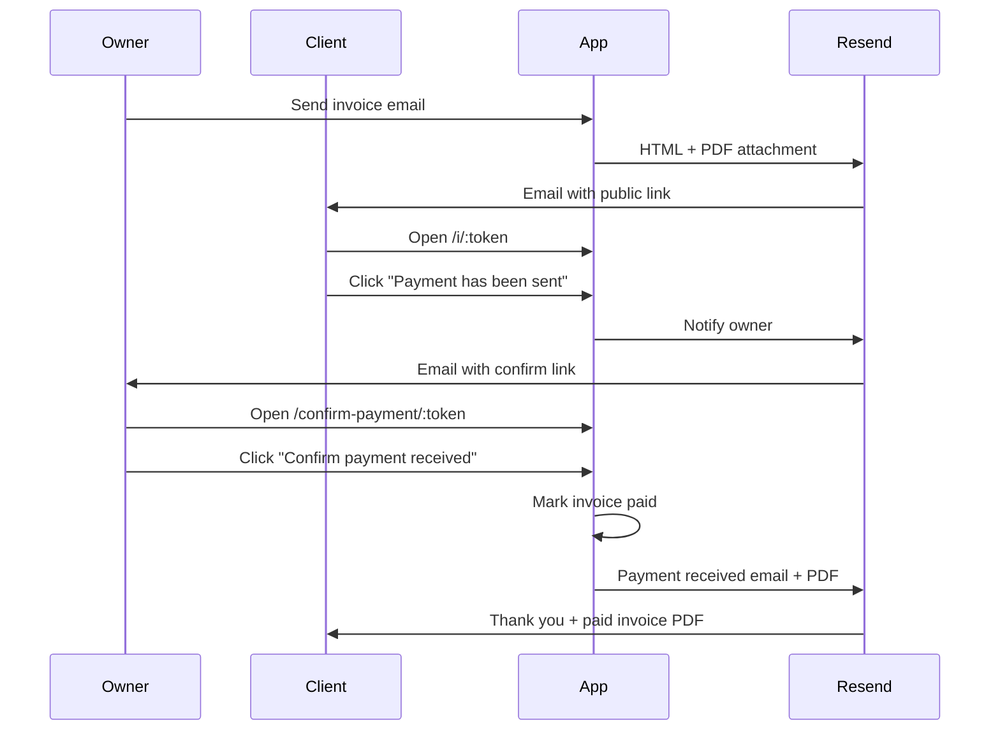

# MyNvoice

MyNvoice is a browser-based invoicing app for freelancers and solo operators. Create professional invoices, log billable work on a calendar, email clients with PDF attachments, collect payments through PayPal or manual bank transfer, and run the full payment lifecycle without spreadsheets or separate tools.

Built with **React 19**, **TypeScript**, **Vite**, **Tailwind CSS v4**, **Supabase** (Postgres, Auth, Edge Functions), **Resend** (email), and **PayPal** (optional online checkout).

---

## Table of contents

- [App overview](#app-overview)
- [Invoices](#invoices)
- [Clients](#clients)
- [Calendar & recurring billing](#calendar--recurring-billing)
- [Email templates](#email-templates)
- [Email history](#email-history)
- [Automated reminders](#automated-reminders)
- [Public payment flow](#public-payment-flow)
- [PayPal checkout](#paypal-checkout)
- [Settings](#settings)
- [How it works](#how-it-works)
- [Tech stack](#tech-stack)
- [Getting started](#getting-started)
- [Scripts](#scripts)
- [Project structure](#project-structure)
- [License](#license)

---

## App overview

After signing in, the sidebar provides six areas:

| View | Purpose |
| --- | --- |
| **Invoices** | Create, edit, send, download, and track invoice status |
| **Calendar** | Log daily billable work and import entries into invoices |
| **Clients** | Manage client records, rates, and recurring line items |
| **History** | Review every invoice email sent (type, date, client) |
| **Templates** | Customize HTML/CSS email templates with live preview |
| **Settings** | Business profile, logo, tax defaults, PayPal, and reminder intervals |

Invoices open in a slide-over panel with a live print preview, action menu (send, remind, download, status changes, delete), and per-invoice reminder controls.

---

## Invoices

### Creating and editing

- **New invoice** — pick a client, set issue date, optional due date, line items, notes, and tax.
- **Line item types** — hourly (quantity × rate), fixed (flat fee), and recurring (imported from the calendar).
- **Tax** — optional per-invoice tax rate; can default from Settings.
- **Drafts** — save without sending; drafts keep their status until you send.
- **Invoice numbers** — auto-increment per client (`INV-001`, `INV-002`, …). The next number is tracked in Settings.
- **Due dates** — optional. When enabled, defaults to issue date + `defaultDueDays` from Settings.

### Status lifecycle

| Status | Meaning |
| --- | --- |
| `draft` | Saved locally in the app; not emailed |
| `unpaid` | Sent to the client; awaiting payment |
| `overdue` | Unpaid and past the due date (computed in the UI and by the reminder cron) |
| `payment_sent` | Client marked payment as sent on the public invoice page |
| `paid` | You confirmed receipt; `paid_at` is recorded |

The invoices table shows **Due** as a countdown (or overdue label) for open invoices, and **—** once paid. The **Reminder** column shows the next scheduled automatic email (or **—**, **Paused**, or **Snoozed**).

### Sending and resending

- **Send invoice** — emails the client with an HTML message and PDF attachment via Resend.
- **Resend invoice** — same flow for already-sent invoices.
- **Send reminder** — available for unpaid invoices; uses the Reminder template.
- **PDF attachment** — generated server-side in the `send-invoice` Edge Function (compact, text-based PDF) so large client-side captures do not block delivery.
- **Download PDF** — client-side print-quality PDF from the live invoice preview (html2canvas + jsPDF).
- **Visit public invoice** — opens the client-facing page in a new tab.

Each send records `email_send_count`, `last_email_sent_at`, and `last_email_sent_kind` on the invoice, and appends a row to email history.

### Per-invoice reminder controls

From the invoice panel you can:

- **Pause** automatic reminders for this invoice
- **Snooze** reminders for 3, 7, or 14 days
- **Override** unpaid and overdue reminder intervals (days between emails)

Overrides stack with client-level and global Settings intervals (invoice → client → Settings).

### Invoice panel actions

- Change status manually (draft, unpaid, paid, etc.)
- Edit line items and client link
- Delete invoice (unbills linked calendar entries)

---

## Clients

Each client stores:

- **Company name** and **contact name** (owner)
- **Primary email** and **additional emails** (all receive invoice emails)
- **Address** (shown on invoices)
- **Default hourly rate** and **additional rate tiers** (quick-select when logging calendar work)
- **Recurring line items** — fixed or hourly charges on a chosen day of month (e.g. retainer on the 1st)
- **Reminder interval overrides** — optional per-client unpaid/late email spacing
- **Recurring calendar exclusions** — skip a recurring item for a specific month

Client edit and new-client panels match the width of the clients list for a consistent layout.

---

## Calendar & recurring billing

### Work log

- Log **hourly** or **fixed** entries per client per day.
- See **unbilled totals** on each calendar day and month summary.
- **Bill entries** by importing them into a new invoice (entries link to the invoice and show as billed).

### Recurring line items

- Defined on the client record (description, rate, day of month, hourly vs fixed).
- Automatically appear on the calendar for unbilled months.
- **Exclusions** — skip one recurring charge for one month (stored per client and in local fallback storage).
- Recurring entries import into invoices like manual calendar entries.

### New invoice from calendar

When creating an invoice, unbilled calendar entries (including generated recurring entries) for that client can be pulled in as line items.

---

## Email templates

Four customizable HTML templates with shared CSS, edited in **Templates** with live preview:

| Template | When it is sent |
| --- | --- |
| **Unpaid** | First send and resends while payment is outstanding |
| **Reminder** | Manual reminder from the invoice menu (unpaid only) |
| **Late** | Automatic overdue notices (cron) |
| **Payment received** | After you confirm payment on the public confirm link |

### Template variables

| Variable | Description |
| --- | --- |
| `{{clientName}}` | Client display name |
| `{{invoiceNumber}}` | Invoice number |
| `{{issueDate}}` | Issue date (formatted) |
| `{{dueDate}}` | Due date or — |
| `{{dueDateLine}}` | Sentence: “Payment is due …” |
| `{{total}}` | Invoice total (currency) |
| `{{businessName}}` | Your business name |
| `{{invoiceLink}}` | Public invoice URL (`/i/:token`) |
| `{{paymentSentLink}}` | Client “payment sent” URL (`/i/:token/payment-sent`) |
| `{{confirmPaymentLink}}` | Owner confirm URL (`/confirm-payment/:token`) |
| `{{paymentDate}}` | Date marked paid |
| `{{emailSendCount}}` | Emails sent count (including current send in previews) |
| `{{nextReminderDate}}` | Next automatic reminder date |

Templates are stored in Supabase (`user_settings.email_templates`) with localStorage fallback for offline editing sync.

---

## Email history

The **History** view lists every invoice email sent:

- Invoice number and client name
- Email kind (unpaid, reminder, late, payment_received)
- Sent timestamp

Useful for auditing what went out and when reminders fired.

---

## Automated reminders

A scheduled Edge Function (`send-invoice-reminders`) runs daily (configure via `migrate-invoice-email-reminders.sql` and Supabase cron/Vault):

1. Marks **unpaid** invoices past due date as **overdue**
2. Sends **reminder** emails for unpaid invoices on the configured interval after the last email
3. Sends **late** emails for overdue invoices on the late interval

Intervals resolve in order: **invoice override → client override → Settings default**.

Invoices respect **pause**, **snooze**, and per-invoice interval overrides. The cron requires `RESEND_API_KEY`, `APP_URL`, and service-role authentication.

---

## Public payment flow

Clients do not need an account. Invoice emails include a secure link to a public page.



### Public routes (no login)

| Route | Who | What happens |
| --- | --- | --- |
| `/i/:token` | Client | View invoice, pay with PayPal, or mark payment sent |
| `/i/:token/payment-sent` | Client | Same page with a prominent confirmation card (no auto-submit on load) |
| `/confirm-payment/:token` | Owner | Preview invoice details, then explicitly confirm payment received |

Security notes:

- Public actions use opaque UUID tokens (`public_token`, `owner_confirm_token`), not guessable IDs.
- Owner confirmation requires a button click (safe from email link prefetchers).
- Payment-sent marking requires a button click on the public page.

---

## PayPal checkout

Optional per-business PayPal integration in Settings:

- **Client ID** and **Client Secret** (stored in Supabase; secret used only in Edge Functions)
- **Sandbox** toggle for testing

On the public invoice page, clients with PayPal configured see a **Pay with PayPal** button. Checkout:

1. Creates a PayPal order server-side (`invoice-public`)
2. Client approves in the PayPal widget
3. Server captures payment, validates amount and invoice reference
4. Marks invoice paid and sends the payment received email

---

## Settings

| Setting | Purpose |
| --- | --- |
| Business name, email, addresses | Shown on invoices and used as email sender |
| Payment details | Bank instructions on the invoice footer |
| Logo | Image on invoice PDFs (client-side download/print) |
| Default tax rate | Pre-fills new invoices |
| Default due days | Offset from issue date when due date is enabled |
| Reminder intervals | Days between automatic unpaid and late emails |
| PayPal credentials | Enable public PayPal checkout |
| Next invoice number | Counter for auto-numbering |

The business email must match a **verified sender** in Resend.

---

## How it works

### Authentication

- Email/password via Supabase Auth
- Row Level Security (RLS) on all tenant tables — users only see their own data
- Settings row auto-created on signup (Postgres trigger)

### Edge functions

| Function | Auth | Role |
| --- | --- | --- |
| `send-invoice` | User JWT | Send invoice/reminder emails; server-generates PDF from `invoiceId` |
| `invoice-public` | Public token + service role | Public invoice read, payment-sent, owner confirm, PayPal |
| `send-invoice-reminders` | Service role (cron) | Daily overdue marking and automatic reminder/late emails |

### Data storage

- **Supabase Postgres** — clients, invoices, calendar entries, settings, email history
- **localStorage** — legacy import path, email template cache, recurring exclusion fallback

---

## Tech stack

| Layer | Tools |
| --- | --- |
| Frontend | React 19, TypeScript, Vite, Tailwind CSS v4 |
| Backend | Supabase (Postgres, Auth, Edge Functions) |
| Email | Resend |
| Payments | PayPal REST API (optional) |
| PDF (download) | html2canvas-pro + jsPDF (client) |
| PDF (email) | jsPDF (Edge Function, server-side) |

---

## Getting started

### Prerequisites

- Node.js 20+
- A [Supabase](https://supabase.com) project
- A [Resend](https://resend.com) account with a verified sender domain
- Supabase CLI (`npm i -g supabase`) for deploying Edge Functions
- Optional: PayPal developer app for online payments

### 1. Clone and install

```bash
git clone https://github.com/anthonyash91/mynvoice.git
cd mynvoice
npm install
```

### 2. Configure the app

```bash
cp .env.example .env
```

```env
VITE_SUPABASE_URL=https://your-project-ref.supabase.co
VITE_SUPABASE_ANON_KEY=your-anon-key
VITE_APP_URL=http://localhost:5173
```

`VITE_APP_URL` must be the URL clients use to open invoice links (production domain in prod, no trailing slash).

### 3. Set up the database

In the Supabase SQL Editor:

1. Run `supabase/schema.sql` for a fresh project
2. For existing databases, apply migrations in `supabase/migrate-*.sql` as needed (payment flow, email templates, reminders, PayPal, history, etc.)

Enable **Email** auth in Supabase (Authentication → Providers).

In **Authentication → URL Configuration**:

| Setting | Value |
| --- | --- |
| **Site URL** | `https://your-production-domain.com` (e.g. `https://mynvoice.onrender.com`) |
| **Redirect URLs** | `https://your-production-domain.com/**` and `http://localhost:5173/**` for local dev |

If Site URL is still `http://localhost:5173`, confirmation emails will send users to localhost after they verify. Set `VITE_APP_URL` on Render to your production URL so signup passes the correct redirect.

### 4. Deploy Edge Functions

```bash
supabase login
supabase link --project-ref your-project-ref

supabase secrets set RESEND_API_KEY=re_your_key
supabase secrets set APP_URL=https://your-production-domain.com
```

`SUPABASE_SERVICE_ROLE_KEY` is injected on deploy — do not set it manually.

For the daily reminder cron (`migrate-invoice-email-reminders.sql`), store Vault secrets named `project_url` and `service_role_key` (current **service_role** key from Project Settings → API). Reminder auth accepts either the injected key or any valid `service_role` JWT, so mild key drift no longer silently blocks all reminders.

```bash
npm run functions:deploy
```

### 5. Deploy the frontend on Render

Public invoice links use client-side routes like `/i/:token`. Render must serve `index.html` for those paths.

**Option A — Web Service (recommended, uses `render.yaml` in this repo)**

1. In Render, create or convert the service to a **Web Service** (Node), not a Static Site.
2. Build command: `npm ci && npm run build`
3. Start command: `npm start`
4. Add environment variables: `VITE_SUPABASE_URL`, `VITE_SUPABASE_ANON_KEY`, `VITE_APP_URL` (your Render URL, no trailing slash).

`npm start` runs `serve -s dist`, which falls back to `index.html` for `/i/*` routes.

**Option B — Static Site (manual rewrite)**

If you keep a Static Site, open **Redirects/Rewrites** in the Render dashboard and add:

| Source | Destination | Action |
| --- | --- | --- |
| `/*` | `/index.html` | Rewrite |

The `public/_redirects` file is for Netlify-style hosts; Render ignores it.

### 6. Configure automated reminders (optional)

Run `supabase/migrate-invoice-email-reminders.sql` in the SQL Editor (includes pg_cron setup instructions and Vault secret placeholders).

### 7. Run locally

```bash
npm run dev
```

Open [http://localhost:5173](http://localhost:5173), sign up, fill in **Settings**, then create a client and send a test invoice.

---

## Scripts

| Command | Description |
| --- | --- |
| `npm run dev` | Start Vite dev server |
| `npm run build` | Typecheck and production build |
| `npm start` | Serve production build with SPA fallback (Render) |
| `npm run preview` | Preview production build |
| `npm run lint` | Run ESLint |
| `npm run functions:deploy` | Deploy all three Edge Functions |
| `npm run functions:serve` | Serve `invoice-public` locally (Docker required) |

---

## Project structure

```
src/
  components/     UI panels, forms, invoice print layout, shared Button/Field/etc.
  views/            Invoices, clients, calendar, history, templates, settings, public pages
  hooks/            Auth, app store, confirm dialogs
  lib/              Database, email, PDF, calculations, templates, reminders

supabase/
  schema.sql              Full schema for new projects
  migrate-*.sql           Incremental migrations
  functions/
    send-invoice/         Authenticated email sender + server PDF
    invoice-public/       Public invoice API + payment flow + PayPal
    send-invoice-reminders/  Daily cron for overdue + reminder/late emails
    _shared/              Shared PDF, email, PayPal, reminder helpers
```

---

## License

Private project. All rights reserved.
